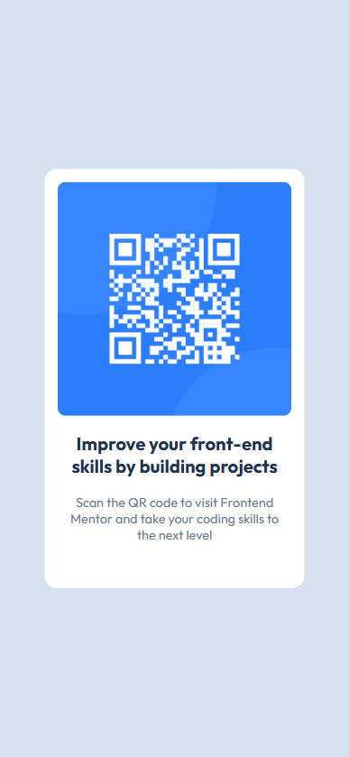
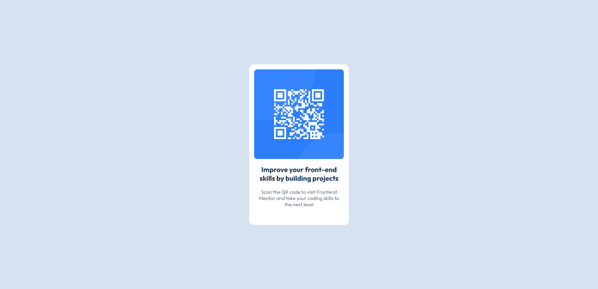

-----

# QR Code Component

This is a solution to the **QR Code Component challenge**.

## Table of contents

  - [Overview](#overview)
      - [The Challenge](#the-challenge)
      - [Screenshot](#screenshot)
      - [Links](#links)
  - [My Process](#my-process)
      - [Built with](#built-with)
      - [What I Learned](#what-i-learned)
      - [Continued Development](#continued-development)
  - [Author](#author)

-----

## Overview

This project is a simple, responsive QR code component built with HTML and CSS. It's a foundational challenge designed to help developers practice basic layout and styling.

### The Challenge

Users should be able to:

  - View the optimal layout for the component depending on their device's screen size.

### Screenshot

| Mobile View | Desktop View |
| :--- | :--- |
|  |  |

### Links

  - Solution URL: [Main File](https://github.com/Sadab-Wasi/QR-code-component/blob/main/index.html)
  - Live Site URL: [Add your live site URL here](https://qr-code-component-theta-murex.vercel.app/)

-----

## My Process

I approached this challenge with a mobile-first philosophy, building the layout and styling for smaller screens before adding media queries for larger devices.

### Built with

  - **HTML5:** Semantic HTML markup.
  - **CSS3:** Custom properties for colors, `flexbox` for layout, and media queries for responsiveness.
  - **Google Fonts:** Used the "Outfit" font for typography.

### What I Learned

This project reinforced my understanding of:

  - **Mobile-first development:** Starting with the smallest screen size and progressively enhancing the layout.
  - **CSS Custom Properties (Variables):** Effectively using `:root` variables to manage colors, making the stylesheet more maintainable.
  - **Flexbox:** Centering elements and structuring the card layout efficiently.
  - **Responsive Design:** Using media queries to adjust the font size for different screen sizes.

<!-- end list -->

```css
/* Example of a custom property */
:root {
  --white: hsl(0, 0%, 100%);
  --slate_300: hsl(212, 45%, 89%);
  /* ... other color variables */
}

/* Example of flexbox usage */
.container {
  display: flex;
  justify-content: center;
  align-items: center;
}
```

### Continued Development

In future projects, I'd like to further explore:

  - More advanced responsive techniques, such as `grid` layout.
  - Implementing more interactive elements using JavaScript.
  - Utilizing CSS preprocessors like Sass for better organization of styles.

-----

## Author

  - GitHub Profile - [@Sadab-Wasi](https://github.com/Sadab-Wasi)